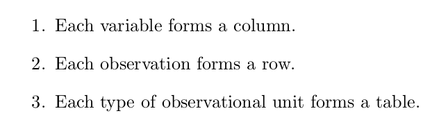

```{r, include=FALSE}
knitr::opts_chunk$set(echo = FALSE, eval = TRUE,
                      fig.align='center',
                      message = FALSE, warning = FALSE)
```


```{r}
library(ggplot2); library(data.table)
library(gridExtra)
data(diamonds)
setDT(diamonds)
```


<!-- https://www.rstudio.com/wp-content/uploads/2015/03/ggplot2-cheatsheet.pdf -->

<!-- TODO:
      DURING:
        reiterate: if you are learning R for the first time why not learn the most flexible/efficient packages?
        make it interactive
        quiz the group
        see if we can build interesting plots together
      
      SOURCES/USEFUL:
        http://www.cookbook-r.com/Graphs/
        mention the ggplot2 book, source code is open so i just built it... 
        careful with books, they can get out of date. stackoverflow is big cheese
    -->


# Why ggplot2?
* flexible, efficient
* **consistent** syntax


## Example data
```{r}
knitr::kable(diamonds[1:5])
```

---
# Expected data structure



???
really important to think about data like this

---
# Things to watch out for:

* columns with >1 variable
```{r}
diamonds[1:5, .(cut_color = paste(cut, color, sep="_"),
                price)]
```


* rows with multiple measures of the same individual/group
```{r}
dcast(diamonds, price ~ cut, value.var = 'z', fun.aggregate = length)[1:5]
```


---
# The solution: data.table melt() and dcast()

```{r}
dcastDiamonds <- dcast(diamonds, price ~ cut, value.var = 'z', fun.aggregate = length, fill=0)
dcastDiamonds[, Price := rownames(dcastDiamonds)][, price := NULL]
setcolorder(dcastDiamonds, c('Price', 'Fair', 'Good', 'Very Good', 'Premium', 'Ideal'))
dfDiamonds <- data.frame(dcastDiamonds[sample(.N, 5)])
dfDiamonds

DT <- dcastDiamonds
```

```{r fake, echo=TRUE, eval = FALSE}
melt(DT, measure.vars = colnames(DT)[-1], 
     variable.name = 'Cut',
     value.name = 'Count')
```

```{r , echo=FALSE, eval = TRUE}
melt(DT, measure.vars = colnames(DT)[-1], variable.name = 'Cut',
     value.name = 'Count')[Count > 5][sample(.N, 5)]
```

---
# ggplot2 syntax

```{r, eval = FALSE, echo = TRUE}
ggplot(DT) + 
  geom_point(aes(x, y))
```

* `ggplot()`
* `geom_*()`
* `aes()`

---
# ggplot2 syntax: ggplot()

Usually called with...

1. `ggplot()`
1. `ggplot(df)`
1. `ggplot(df, aes(x, y, ..))`

???

1. for empty
2. to set the data source
3. to set data source and consistent aes
        most restrictive, but can be changed below
        in geoms regardless still

---
# ggplot2 syntax: geom_*
Type of layer added, for example:


[ggplot2 graph gallery](http://www.r-graph-gallery.com/portfolio/ggplot2-package/)


---
# ggplot2 syntax: aes

**The rule is: if there is a data link, set it in the `aes`. Otherwise, it is set outside of the `aes`.**

Links the data to aesthetic properties.

* ID -> color
* Treatment -> linetype
* value -> point size

(it also matches base R arguments to ggplot2 arguments 

eg: pch to shape, cex to size)

Many properties: 

* size, shape, type
* fill, color, alpha
* linetype
???
<!-- THE RULE TO THINK ABOUT IS: -->
<!--   am i using the data to set an aesthetic  -->
<!--   or is it a global setting -->

<!-- inside aes we can call column names without quoting -->
<!-- non standard evaluation  -->

---
class: review

# Exercise: basic plotting

1. Open: `R/intro-ggplot-worksheet.R` 
2. Complete section - Basic ggplot2

---
# Legend

Legends are controlled by the function `guides()`

To remove the legend
```{r, eval = FALSE, echo=TRUE}
ggplot(diamonds) +
  geom_point(aes(cut, price, color = price)) + 
  guides(color = FALSE)
```

To make finer adjustments to the legend, use:

* `guide_legend` for discrete
* `guide_colorbar` for continuous

---
# Axis Labels

Axis labels are controlled by the function `labs()`

```{r, eval = FALSE, echo=TRUE}
ggplot(diamonds) + 
  geom_point(aes(cut, carat, color = price)) + 
  labs(x = 'Cut', y = 'Carat', color = 'Price')
```

---
# Use of factor variables
```{r, eval = TRUE, echo=TRUE, out.height = '400px', out.width = '550px'}
ggplot(diamonds) + 
  geom_point(aes(cut, carat, 
                 color = factor(cut, 
                                labels = c('1', '2', '3', '4', '5')))) +
  labs(x = 'Cut', y = 'Carat', color = 'Cut')
```

---
# Facetting

```{r, eval = TRUE, echo = TRUE, out.height = '400px', out.width = '550px'}
ggplot(diamonds) + 
  geom_point(aes(carat, price)) + 
  facet_wrap(~cut)
```


---
# Combining plots

**UPDATE**: The one and only...  [`patchwork`](https://patchwork.data-imaginist.com/)

---
class:review

# Exercise: spatial Plotting

1. Open `intro-ggplot-worksheet.R`
1. Section - Spatial ggplot2


Considerations:

* ensure your data is consistently projected/unprojected
* `broom::tidy()` (or `fortify()`) SpatialPolygons

**UPDATE**: use the `sf` package and `geom_sf`

---
# Iterative plotting
Need to make a plot more than once? 

**Don't Repeat Yourself...** Write a function!

```{r, eval=FALSE, echo=TRUE}
PlotXY = function(in.dt, group, xcol, ycol){
    g <- ggplot(in.dt) +
      geom_point(aes(get(xcol), get(ycol))) +
      labs(title = as.character(group))
    print(g) 
  return(1)
}

DT[, PlotXY(.SD, .BY,
            'EASTING', 'NORTHING'),
   by = HERD]
```


---
class: clear
```{r, eval = FALSE, echo = TRUE}
HistoWithVline <- function(in.dt, metric){
  ggplot(in.dt[observed == 0]) +  
  geom_histogram(aes(get(metric))) +  
  geom_vline(aes(xintercept = get(metric), color = 'red'), 
             data = in.dt[observed == 1]) + 
  guides(color = FALSE) + labs(x = metric)
}

ByIDHisto <- function(in.dt, id){ 
  g1 <- HistoWithVline(in.dt, 'centrality_soc')
  g2 <- HistoWithVline(in.dt, 'strength_soc')
  g3 <- HistoWithVline(in.dt, 'degree_soc')
  grid.arrange(g1, g2, g3,  
               top = textGrob(as.character(id), just = "top")) 
  return(1) 
} 
pdf('graphics/net_metrics_by_ID.pdf') 
all.dyn.net[, ByIDHisto(.SD, .BY), by = ID] 
dev.off() 
```

---
# Multipanel plotting
**UPDATE**: use `patchwork`


function = `gridExtra::grid.arrange()`


```{r, eval = FALSE, echo = TRUE}
lsPlots <- lapply(seq_along(lsDTs), FUN = function(i){
  ID <- names(lsDTs)[i]
  
  g <- ggplot(lsDTs[[i]]) +
    geom_path(aes(EASTING, NORTHING)) + 
    geom_text(aes(max(EASTING), max(NORTHING)), 
                      label = ID, color = 'forestgreen') + 
    theme(axis.text = element_blank()) + 
    labs(x = NULL, y = NULL)
})

do.call(grid.arrange, lsPlots)
# or
# grid.arrange(grobs = lsPlots)
```

---
# Things to explore on your own
* changing the theme (`theme()`)
* `scale_color_*()` (and similar functions) for changing color ramps
* `rasterVis::gmap()` for plotting rasters

---
# Resources and references

**UPDATE**: [the ggplot book](https://ggplot2-book.org/)

https://github.com/jennybc/ggplot2-tutorial/blob/master/ggplot2-tutorial-slides/

http://vita.had.co.nz/papers/tidy-data.pdf

http://www.r-graph-gallery.com/portfolio/ggplot2-package/

https://www.rstudio.com/wp-content/uploads/2015/03/ggplot2-cheatsheet.pdf 
