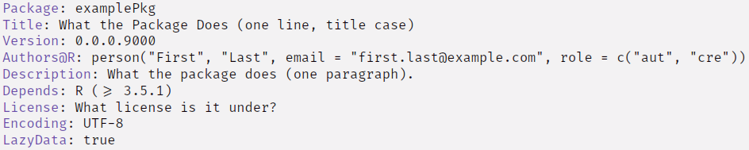
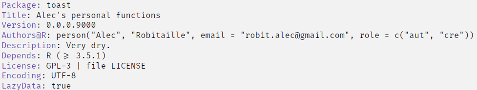
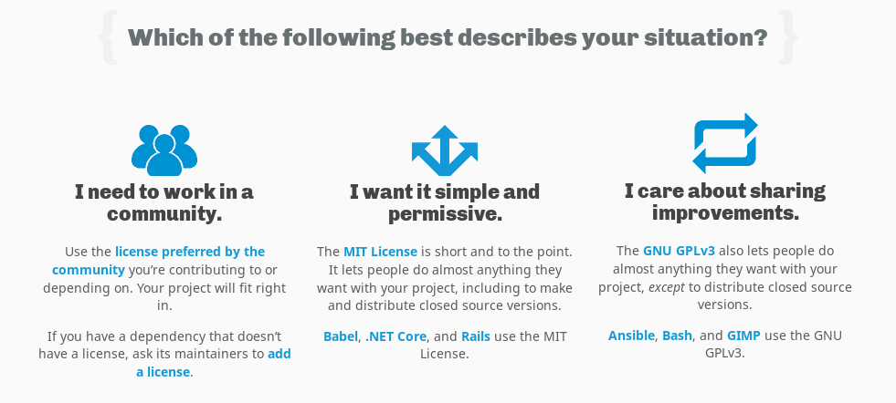

  
```{r setup, include=FALSE}
knitr::opts_chunk$set(echo = TRUE,
                      eval = FALSE)
```


# Tools to simplify package development

.pull-left[
[R Packages by Hadley Wickham](http://r-pkgs.had.co.nz/)


]

.pull-right[


.footnote[
[`devtools`](https://github.com/r-lib/devtools) 
[`roxygen2`](https://github.com/klutometis/roxygen)
[`testthat`](https://github.com/r-lib/testthat/)
[`usethis`](https://github.com/r-lib/usethis)
]
]
???

Advanced R is the go-to book

devtools builds package skeletons, installs from git, runs checks, tests etc.

roxygen2 helps parse within-function documentation


---

# Package skeleton

```{r createPkg}
usethis::create_package("Local-git/toast")
```

```{bash tree, eval = TRUE, echo = FALSE}
tree ../toast -a -L 1 --dirsfirst
```

???
COMMIT

OPEN THE RPROJECT
---
# DESCRIPTION
Details about package authorship, use, dependencies, license, ...






???

COMMIT

---

# Package states
.center[


]
???
don't look at this (hahaha)


---
# Package install
.center[


]

???
don't look at this (haha)

the interest here is how your packages are transfered from CRAN/github to installed packages
always through R CMD install


---
class: important 

# A recipe for building a package

1. `usethis::create_package("Local-git/toast")`
1. Update `DESCRIPTION`
1. Write functions (`R/`)
1. Update `NAMESPACE`
	- Importing external packages with `usethis::use_package('pkg')`
1. Document functions (`man/`) 
	- Using `roxygen2` comments in `R/` files with `devtools::document` (or `ctrl+shift+d`)
1. Test functions
	- Writing unit tests run by `testthat` with `devtools::test()` (or `ctrl+shift+t`)
1. Share, collaborate, reuse, improve. 

.pull-left[

**Commit often. Rebuild often. **

hint: change [this](http://r-pkgs.had.co.nz/man.html#man-workflow-2) setting and use `ctrl+shift+b` to document and rebuild with one shortcut. 
]
.pull-right[

]

???
Between each of these steps, COMMIT

Between most of these steps, BUILD and test 


---
# Function


Save the following code chunk in `R/dir_importer.R`.

```{r dirImporter}
#' @export
dir_importer <- function(paths, named = FALSE) {
	if (named) {
		lapply(seq_along(paths), function(x) {
			fread(paths[x])[, nm := names(paths)[x]]
		}) %>% rbindlist()
	} else {
		lapply(paths, fread) %>% rbindlist()
	}
}
```

Rebuild the package and documentation (`ctrl+shift+b`). Test it in another script. 

```{r useDirImporter}
library(toast)
paths <- dir('tests/testdata', '*.csv', full.names = TRUE)
names(paths) <- dir('tests/testdata', '*.csv')
DT <- dir_importer(paths, named = TRUE)
```

???
1. Copy the chunk into `R/dir_importer.R`
1. COMMIT
1. try it out with `ctrl+shift+b` and `toast::dir_importer`

---
# NAMESPACE

Our new function did not work...  
because we are missing external packages in our NAMESPACE and DESCRIPTION files. 

.pull-left[
1&#46; Import all external functions (from other packages). $^1$

`data.table::fread` instead of `fread`

or

`#' @importFrom data.table fread`
]

.pull-right[
2&#46; Add packages to Imports $^{2, 3}$ (*or Depends* $^4$) in the DESCRIPTION. 
```{r}
# usethis::usepackage
use_package('magrittr', 'Imports')
use_package('data.table', 'Depends') #4
```


> (use `ctrl+shift+b` to document and rebuild.)

]
.footnote[
[1] [SO: importFrom vs ::](https://stackoverflow.com/questions/24651101/how-should-i-reference-functions-in-imported-packages?noredirect=1&lq=1)

[2] [SO: Using magrittr's pipe in a package](https://stackoverflow.com/questions/27947344/r-use-magrittr-pipe-operator-in-self-written-package/27979637#27979637)

[3] [SO: Using data.table in a package](https://stackoverflow.com/questions/10527072/using-data-table-package-inside-my-own-package)

[4] [SO: Depends vs Imports](https://stackoverflow.com/questions/8637993/better-explanation-of-when-to-use-imports-depends)
]

???

http://r-pkgs.had.co.nz/screenshots/build-reload-opts-2.png
this method

---

# README.md

A README is crucial for any package, repository, project. It is the overview, brief usage guide and context for users (including your [future self](https://www.npr.org/programs/invisibilia/533660783/future-self)).

### Overview
The `toast` package is a collection of Alec's personal functions, for everyday bread. 

### Installation
```{r}
devtools::install_git('https://gitlab.com/robit.a/toast.git')
```

### Usage
```{r}
library(toast); library(data.table) #always

paths <- dir('tests/testdata', '*.csv', full.names = TRUE)
names(paths) <- dir('tests/testdata', '*.csv')
DT <- dir_importer(paths, named = TRUE)

if (DT[, unique(nm)] == length(paths)) print('toasted')
```

---

# LICENSE

[Choose a license](https://choosealicense.com/) or talk to your lawyer. 



For example:

`usethis::use_gpl3_license('Alec Robitaille')`

???

Lacking a license, full copyright. 


---


# Documentation

```{r}
#' dir importer
#' Provided a named list or list of files (produced with \code{dir}),
#' returns a combined \code{data.table} of all files.
#' If the list is named, these names are added as a column to the \code{data.table}.
#'
#' @return All files imported and combined into a single \code{data.table}.
#'
#' @param paths the named list or unnamed list representing the paths to CSV files
#' @param named boolean indicating if list is named or not.
#' if named, names from the list will be used to differentiate imported files.
#'
#' @export
#' @importFrom magrittr %>%
#' @examples
#' paths <- dir('tests/testdata', '*.csv', full.names = TRUE)
#' names(paths) <- dir('tests/testdata', '*.csv')
#' dir_importer(paths, named = TRUE)
dir_importer <- function(paths, named = FALSE) {
...
}
```

---
# Documentation

`@export`: export the function, **making it available to the user**


`@param`: document arguments

* `@param paths the named list or unamed list...`

`@return`: description of function's output

* `@return All files imported and combined into a single \code{data.table}.`

`@examples`: examples of function's usage

* `#' @examples`  
`#' paths <- dir('tests/testdata', '*.csv', full.names = TRUE)`  
`#' names(paths) <- dir('tests/testdata', '*.csv')`  
`#' dir_importer(paths, named = TRUE)`


More [here](http://r-pkgs.had.co.nz/man.html#roxygen-comments).


---

# Testing


1. `usethis::use_testthat()`
2. Create a test file 
3. Expectations are grouped into tests. 

`dir_importer` expects that `named` is a boolean. We can enforce this, with an added check in the function:

`R/dir_importer.R`, at the beginning of the function. 
```{r}
if(!is.logical(named)) stop('you are not logical')
```

The test script: `tests/testthat/test_dir.R`
```{r}
library(toast)
context('testing dir_importer')
paths <- dir('tests/testdata', '*.csv', full.names = TRUE)

test_that('named is a boolean', {
  expect_error(dir_importer(paths, named = 10),
               'you are not logical')
})
```

---
# Testing
`tests/testthat/test_dir.R`

```{r}
# Load the package
library(toast)

# Provide the context
context('testing dir_importer')

# Create your data to test on
paths <- dir('tests/testdata', '*.csv', full.names = TRUE)

# Testing that the named parameter has to be a boolean
test_that('named is a boolean', {
	# the 'you are not logical' error is expected if a numeric is provided
  expect_error(dir_importer(paths, named = 10),
               'you are not logical')
	
	# the 'you are not logical' error is expected if a character is provided
  expect_error(dir_importer(paths, named = 'potato'),
               'you are not logical')
})
```

---
# Next steps


* profile your functions

* push your code

* check your `goodpractice::gp()`

* collaborate

* share

* CRAN

* check your code coverage `covr`

* eat cabbage


---

# References

## Books
[R Packages by Hadley Wickham](http://r-pkgs.had.co.nz/)


## Packages
[`devtools`](https://github.com/r-lib/devtools) 
[`roxygen2`](https://github.com/klutometis/roxygen)
[`testthat`](https://github.com/r-lib/testthat/)
[`usethis`](https://github.com/r-lib/usethis)


## StackOverflow
[SO: importFrom vs ::](https://stackoverflow.com/questions/24651101/how-should-i-reference-functions-in-imported-packages?noredirect=1&lq=1)

[SO: Using magrittr's pipe in a package](https://stackoverflow.com/questions/27947344/r-use-magrittr-pipe-operator-in-self-written-package/27979637#27979637)

[SO: Using data.table in a package](https://stackoverflow.com/questions/10527072/using-data-table-package-inside-my-own-package)

[SO: Depends vs Imports](https://stackoverflow.com/questions/8637993/better-explanation-of-when-to-use-imports-depends)
