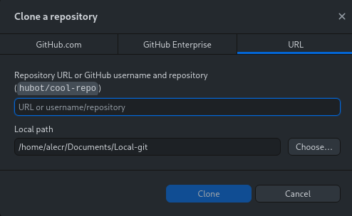

```{r setup, include=FALSE}
knitr::opts_chunk$set(echo = TRUE,
                      eval = TRUE)
```


# Why Git

Tracks history
* explicitly save versions of files, without resorting to `my_file_2015-05-20.docx` or `FINAL_final_file_12.R`
* full backup of who changed what when, and (with a *Good* Commit Message $^{[1, 2]}$) why

Diverse uses
* small projects, big projects, papers, books, websites, software, ...

Broaden collaboration and contributions
* eg. R packages, communities like rOpenSci and The Carpentries, ...

Finally, **Git helps you code...**

.footnote[
Read more: 
[1](https://chris.beams.io/posts/git-commit),
[2](https://tbaggery.com/2008/04/19/a-note-about-git-commit-messages.html)
]

???
Git helps you code:

turns an otherwise sometimes undirected, chaotic workflow into
a feedback cycle

change something, see what change, save you like/want 

is your function working all of a sudden? is your plot looking right?

- check what changed to see why


---
class:important

# Integrating Git into your workflow

.center[
.large[
Q: How do you work?
]

(Answer with your regular routine in the shared note)
]


--

<hr>

.center[
.large[
Let's add Git
]
]


.center[


]

???
As detailed or brief as you'd like - but something along the lines of 
eg. I switch between my browser + my RStudio when I'm trying to solve a 
problem, and I keep hammering away until I get it. When I do, I save the script
and take a break. 

Where can we fit Git in?

We might say - every 5 minutes, or every 30 minutes, open up Git and 
see what you've changed. Are these useful changes? Did any of these work, 
or do they represent useful steps along the way? Commit!

An alternative is, right after you finally save your script after the solution, 
make a commit. Quicker, simpler, but with less feedback. 

---
# How to Git: basics


.footnote[
More cheatsheets and summaries: [1](https://ndpsoftware.com/git-cheatsheet.html#loc=local_repo),
[2](https://training.github.com/downloads/github-git-cheat-sheet/)

Image from [3](https://support.nesi.org.nz/hc/en-gb/articles/360001508515-Git-Reference-Sheet)
]

---
class:review

# How to Git: solo


.pull-left[
Setup

1. Make a repository: [GitLab](https://gitlab.com/projects/new), [GitHub](https://github.com/new)

1. Add members

1. Clone to your computer


Daily
1. Locally edit (eg. the README)

1. Commit changes

Occasionally 

1. Push (not necessary after every commit)

1. Check your repository online
]

.pull-right[



]


---
# How to Git: teams

**Use branches to isolate tasks and avoid conflicts**  $^{[1, 2, 3]}$

Then merge your separate branches into the main branch, when it's ready

Result: combine everyone's work together into a unified result


.footnote[
Read more: [1](https://happygitwithr.com/common-remote-setups.html),
[2](https://happygitwithr.com/git-branches.html),
[3](https://the-turing-way.netlify.app/reproducible-research/vcs/vcs-workflow.html)

Image from [3](https://the-turing-way.netlify.app/reproducible-research/vcs/vcs-workflow.html)
]

---
class:review

# How to Git: teams

1. Clone the git-intro-penguins repository
1. Pick a feature to add
1. Make a branch for that feature
1. Work on that feature
	* Write a function with eg. `plot_flipper_by_species`, `calc_mean_flipper_length` naming scheme
	* Save it in the R folder with the filename matching the function name
1. Commit as you go
1. Push 

.pull-right[

]


.footnote[
More penguin info [here](https://allisonhorst.github.io/palmerpenguins/)
]

---
# Git Tips

Use a `.gitignore` $^{[1]}$

Do not commit large files (anything >50mb)

<hr>

Git can only *diff* some filetypes, eg. text files like `.R`, `.Rmd`, `.md`, and `.csv`, 
and images `.png`

Use the `github_document` output format while developing an RMarkdown
document, later rendering a PDF or `docx` $^{[2]}$ (or use `keep_md: true`)

This can also be leveraged to look at how output figures $^{[3]}$, and tables $^{[4]}$ change

<hr>

Dealing with disasters $^{[5, 6]}$


.footnote[
Read more:
[1](https://docs.github.com/en/get-started/getting-started-with-git/ignoring-files),
[2](https://happygitwithr.com/workflows-browsability.html?q=gitignore#r-markdown),
[3](https://github.com/robitalec/ScaleInMultilayerNetworks/commit/90327e42aa4d0f76d748f49c62b152a2935d605e?short_path=03e63b1#diff-03e63b14fd55e5556148f615b0f48ee1d9d04ee6e7e22219953d37c14043a4c5),
[4](https://github.com/wildlifeevoeco/SnailPace/commit/cd05e369f925a53edd6079156994bd0c9eb7f746#diff-d212c5037536750b7de11f8638f2914dd504d5a1054de94bf39995cd10ee5d3b),
[5](https://happygitwithr.com/burn.html),
[6](https://happygitwithr.com/ideas-for-content.html#common-workflow-questions)
]

---
# Later Git

Practice! Use Git with your own projects, for classes, for *fun*

Set up SSH: instructions from [Happy Git With R](https://happygitwithr.com/ssh-keys.html), and [Software Carpentry](https://swcarpentry.github.io/git-novice/07-github/index.html#https-vs-ssh)

Read, there are tons of great resources

* [Git documentation](https://git-scm.com/doc)

* [Pro Git](https://git-scm.com/book/en/v2), full free online book

* [Happy Git With R](https://happygitwithr.com/)

* [Software Carpentry: Version Control With Git](https://swcarpentry.github.io/git-novice/)

* [Git section](https://csgillespie.github.io/efficientR/collaboration.html#version-control) in Efficient R

* [Git Best Practices](https://sethrobertson.github.io/GitBestPractices/)

* [Turing Way: VCS](https://the-turing-way.netlify.app/reproducible-research/vcs)

.footnote[
Thanks to all developers of Git, R, RStudio, R packages, Git GUIs, ... 
]

