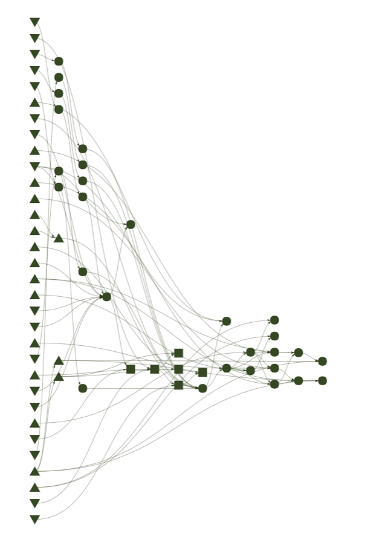

# Context

Introducing `targets` and the `targets-issa` workflow. 


- https://github.com/robitalec/targets-issa
- https://issa-guild.github.io/book/

---
# What's in a workflow?

--

- Data

--

- Variables

--

- Prepare data

--

- Analyse data (extract layers, measure steps, turn angles)

--

- Model

--

- Plots, predictions, ...


---
# The targets-iSSA workflow

.center[

]


---
# Why targets?

- Reproducible

- Digestible

- Time savings

- Evidence


---
# Ingredients

- Functions

- Targets

- Packages


---
# Ingredients: Functions


.pull-left[
```{r, eval = FALSE}
library(ggplot2)
library(data.table)

DT <- data.table(mtcars)

DT_gear_4 <- DT[gear == 4]
DT_gear_5 <- DT[gear == 5]

# ...

ggplot(DT_gear_4) + 
	geom_point(aes(mpg, cyl)) +
	theme(base_size)

ggplot(DT_gear_4) + 
	geom_point(aes(mpg, cyl)) +
	theme(base_size)

```
]

.pull-right[
```{r, eval = FALSE}
plot_mpg_cyl <- function(DT) {
	ggplot(DT) + 
	geom_point(aes(mpg, cyl)) +
	theme(base_size)
}
```

```{r, eval = FALSE}
plot_mpg_cyl(DT_gear_4)
plot_mpg_cyl(DT_gear_5)
```

.footnote[
[Targets manual: functions](https://books.ropensci.org/targets/functions.html)
]

]


---
# Ingredients: Targets


.pull-left[
```{r, eval = FALSE}
tar_target(
	name,
	command
)
```
]

.pull-right[
```{r, eval = FALSE}
tar_target(
	plot_cars,
	plot_mpg_cyl(mtcars)
)
```
]


Other arguments

- `pattern = map(branch)`
- `format = 'file'`
- `cue = tar_cue('always')`


---
# Ingredients: Packages

`R/packages.R`

```
library(targets)

library(renv)

library(data.table)
library(parsedate)
library(ggplot2)

library(amt)
library(sf)
library(raster)
library(distanceto)

library(glmmTMB)
```


---
# Make

`tar_make()`


.footnote[

Shortcuts! Background jobs! `Rscript`!

]


---
# Read


---
# Extras: renv

`renv` paired with `targets`:

Package management

and 

Reproducible workflow


---
# Resources


`targets`

* [targets User Manual](https://books.ropensci.org/targets/)
* [targets documentation](https://docs.ropensci.org/targets/)

`renv`

* [renv documentation](https://rstudio.github.io/renv/)
