```{r setup, include=FALSE}
options(htmltools.dir.version = FALSE)
```

background-image: url("images/ducksandzebras.png")
background-position: center
background-size: contain

# The paradox of being social in spatial context


---


# History of spatsoc

* ### Linking social behavior and space use
* ### Most practical to use animals with GPS collars
* ### GPS collars typically used to quantify measures of habitat selection or movement, but not social proximity
* ### Webber and Vander Wal review links between social and spatial ecology


---
background-image: url("images/evoframe.png")
background-position: center
background-size: contain


# History of spatsoc


---


# History of spatsoc: big ideas, big data

## Idea: 
* #### Individualize social network proximity and habitat selection patterns and determine how these traits influence reproductive success.

## Data:
* #### Caribou in Newfoundland, Elk and wolves in Manitoba
* #### For example, in Newfoundland, many studies quantifying habitat selection patterns for Newfoundland caribou, but no incorporation of social processes

.center[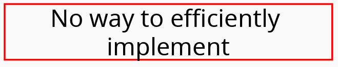]


---

# Informal implementation

* ### Need for functions to generate social networks for GPS collared caribou
* ### Original “home-made” functions made by Quinn were limited
.pull-right[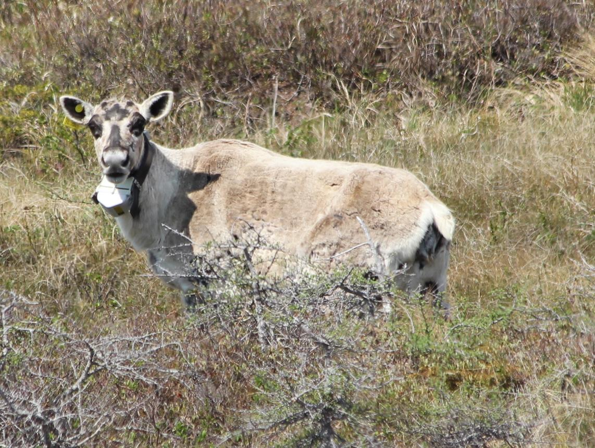]

	* #### Inflexible
	* #### Slow
	* #### Prone to breaking


---

# Formal implementation

* #### Early functions simply generated buffers around an individual's temporally discrete GPS fixes and detected whether other individuals were within those buffers

.center[]

---

# History of spatsoc: putting it to the test 


.center[
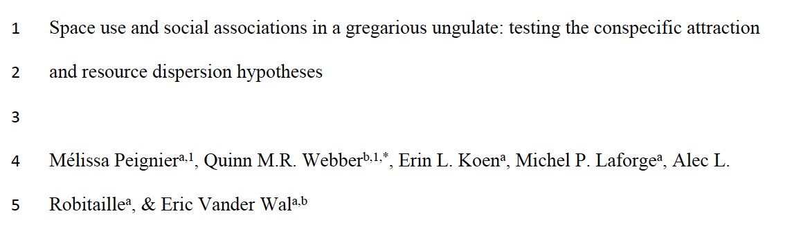

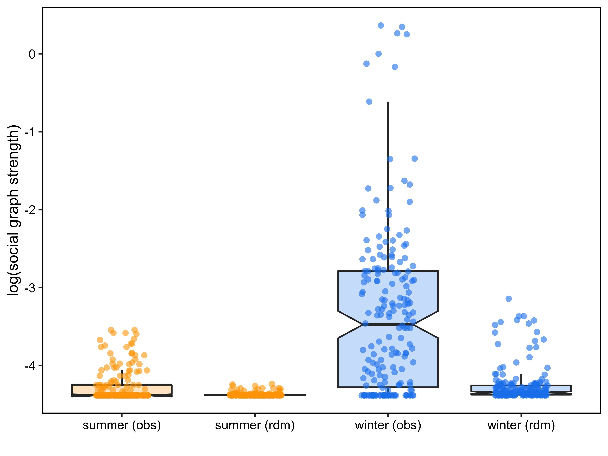
]

???
spatsoc used to generate proximity based social networks and compared across seasons


---

# History of spatsoc: applications

* #### Social processes can be relevant for conservation managers: 
	* #### Allee effects
	* #### Detection-dilution trade-off for predators
* #### Detect locations where animals aggregate
* #### Determine whether animals more likely to aggregate at certain times of year
* #### If survival/reproductive of collared animals is known, can determine whether social association was related to survival

.center[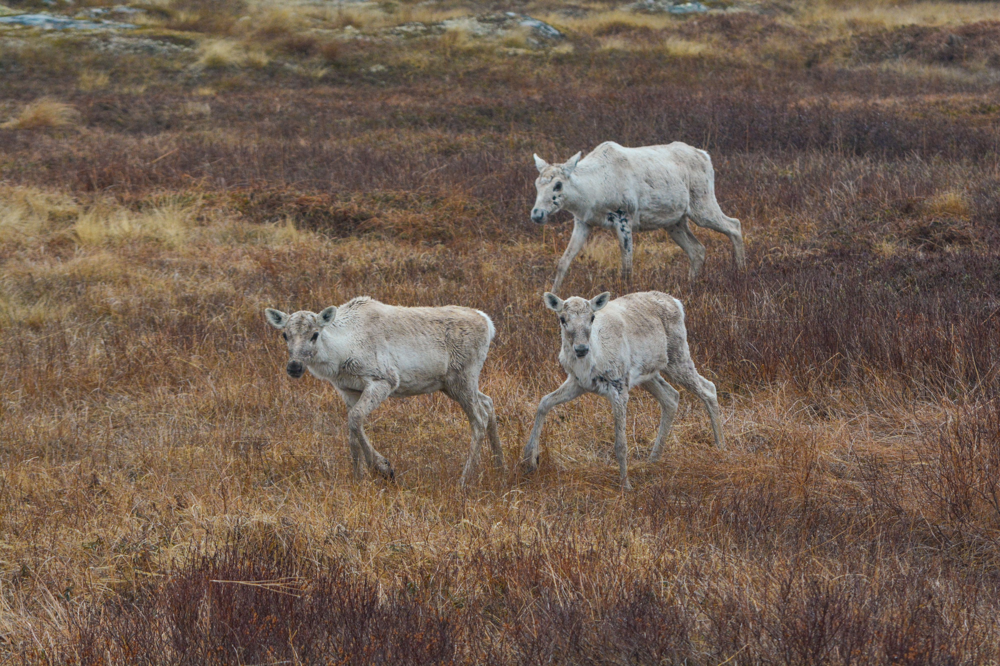]

---

# Package basics

.pull-left[
```{r, echo = FALSE}
library(DiagrammeR)
g <- grViz('digraph {
	graph [rankdir=TB, compound=TRUE, fontname = "Helvetica", fontsize = 20, bgcolor = "#FAFAFA"]
  node [fontname = "Helvetica", fontsize = 22];
	script -> function -> package 
  script [label = <Scripts<BR/><FONT POINT-SIZE="18">(useful)</FONT>>] 
  function [label = <Functions<BR /><FONT POINT-SIZE="18">(reusable)</FONT>>] 	
	package [label = <Packages<BR /><FONT POINT-SIZE="18">(shareable)</FONT>>] 
	}')
g
```
]

.sidebar[
Package checklist:

$\> \checkmark$ novel and interesting method   
$\> \Box$ easy to use, flexible   
$\> \Box$ extensive documentation  
$\> \Box$ well tested  
]


???
<!-- ## how spatsoc works -->


---
# Workflow


```{r, echo = FALSE, out.width='800px'}
g <- grViz(
	"
	digraph spatsoc_functions  {
	graph [rankdir=TB, compound=TRUE, fontname = 'Helvetica', bgcolor = '#FAFAFA']
  node [fontname = 'Helvetica'];

	# functions
#	function [shape = 'rectangle']
	spgrp [label = 'spatial grouping', shape = 'rectangle']
	tgrp [label = 'temporal grouping', shape = 'rectangle']
	rand [label = 'randomizations', shape = 'rectangle']

	# input
#	data [shape = 'diamond']
	input [label = 'telemetry data', shape = 'diamond']

	# output
#	output [shape = 'ellipse']
	obs [label = 'observed network', shape = 'ellipse']
	rdm [label = 'randomized networks', shape = 'ellipse']


#	subgraph cluster_workflow {
#  label= 'Workflow' labeljust='l';
	{rank=same; rdm; obs}

	input -> tgrp -> spgrp -> obs
	spgrp -> rand -> rdm
	#}

#	subgraph cluster_legend {
# label= 'Legend' labeljust='l';
#	data -> function -> output
#	}
	}
	")
g
```


---
# Temporal grouping

```{r, eval = FALSE}
group_times(DT, datetime = c('idate', 'itime'), threshold = '5 minutes')
```

.pull-left[
* grouped by "nearest"
* threshold must be divisible by 24 hours or 60 minutes


|idate      |    itime| minutes| timegroup|
|:----------|--------:|-------:|---------:|
|2018-12-12 | 01:00:00|       0|         1|
|2018-12-12 | 01:02:00|       0|         1|
|2018-12-12 | 01:01:00|       0|         1|
|2018-12-12 | 03:00:00|       0|         2|
|2018-12-12 | 03:02:00|       0|         2|
|2018-12-12 | 03:00:00|       0|         2|
|2018-12-12 | 05:00:00|       0|         3|
|2018-12-12 | 05:01:00|       0|         3|
|2018-12-12 | 05:01:00|       0|         3|
]


.fixed-pos-r[
```{r, echo = FALSE, out.width='425px'}
g <- grViz(
	"
	digraph spatsoc_functions  {
	graph [rankdir=TB, compound=TRUE, fontname = 'Helvetica', bgcolor = '#FAFAFA']
  node [fontname = 'Helvetica'];

	# functions
#	function [shape = 'rectangle']
	spgrp [label = 'spatial grouping', shape = 'rectangle']
	tgrp [label = 'temporal grouping', shape = 'rectangle', color='red']
	rand [label = 'randomizations', shape = 'rectangle']

	# input
#	data [shape = 'diamond']
	input [label = 'telemetry data', shape = 'diamond']

	# output
#	output [shape = 'ellipse']
	obs [label = 'observed network', shape = 'ellipse']
	rdm [label = 'randomized networks', shape = 'ellipse']


#	subgraph cluster_workflow {
#  label= 'Workflow' labeljust='l';
	{rank=same; rdm; obs}

	input -> tgrp -> spgrp -> obs
	spgrp -> rand -> rdm
	#}

#	subgraph cluster_legend {
# label= 'Legend' labeljust='l';
#	data -> function -> output
#	}
	}
	")
g
```
]

---
# Spatial grouping

.center[[`data.table`](https://github.com/Rdatatable/data.table) + GIS operations + [`igraph`](https://github.com/igraph/rigraph)]


.pull-left[
|function      |    operation | 
|:----------|--------:|
|`group_pts` | distance matrix |
|`group_lines` | line intersection |
|`group_polys` | polygon overlap |
]

.fixed-pos-r[
```{r, echo = FALSE, out.width='425px'}
g <- grViz(
	"
	digraph spatsoc_functions  {
	graph [rankdir=TB, compound=TRUE, fontname = 'Helvetica', bgcolor = '#FAFAFA']
  node [fontname = 'Helvetica'];

	# functions
	spgrp [label = 'spatial grouping', shape = 'rectangle', color='red']
	tgrp [label = 'temporal grouping', shape = 'rectangle']
	rand [label = 'randomizations', shape = 'rectangle']

	# input
	input [label = 'telemetry data', shape = 'diamond']

	# output
	obs [label = 'observed network', shape = 'ellipse']
	rdm [label = 'randomized networks', shape = 'ellipse']


	{rank=same; rdm; obs}

	input -> tgrp -> spgrp -> obs
	spgrp -> rand -> rdm
	}
	")
g
```
]


---
# Spatial grouping: points
```{r, eval = FALSE}
group_pts(DT, threshold = 5, id = 'ID',
          coords = c('X', 'Y'), timegroup = 'timegroup')
```

.pull-left[
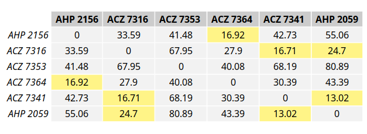
]

.fixed-pos-r[
```{r, echo = FALSE, out.width='425px'}
g <- grViz(
	"
	digraph spatsoc_functions  {
	graph [rankdir=TB, compound=TRUE, fontname = 'Helvetica', bgcolor = '#FAFAFA']
  node [fontname = 'Helvetica'];

	# functions
	spgrp [label = 'spatial grouping', shape = 'rectangle', color='red']
	tgrp [label = 'temporal grouping', shape = 'rectangle']
	rand [label = 'randomizations', shape = 'rectangle']

	# input
	input [label = 'telemetry data', shape = 'diamond']

	# output
	obs [label = 'observed network', shape = 'ellipse']
	rdm [label = 'randomized networks', shape = 'ellipse']


	{rank=same; rdm; obs}

	input -> tgrp -> spgrp -> obs
	spgrp -> rand -> rdm
	}
	")
g
```
]


---


# Spatial grouping: lines
```{r, eval = FALSE}
group_lines(DT, threshold = 50, projection = utm,
            id = 'ID', coords = c('X', 'Y'),
            timegroup = 'timegroup', sortBy = 'datetime')

```

.pull-left[
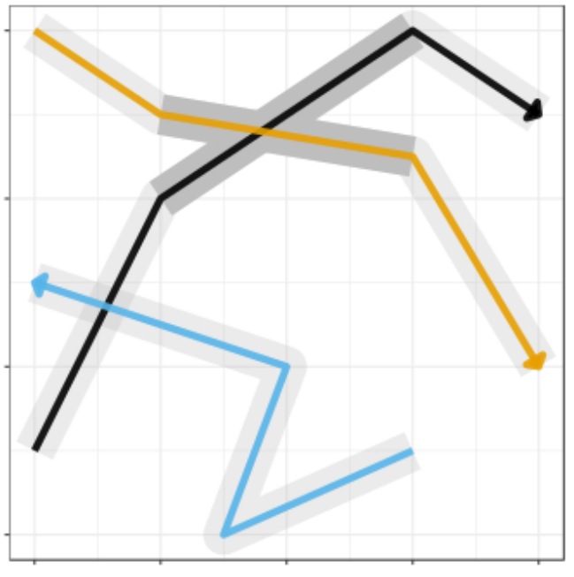
]


.fixed-pos-r[
```{r, echo = FALSE, out.width='425px'}
g <- grViz(
	"
	digraph spatsoc_functions  {
	graph [rankdir=TB, compound=TRUE, fontname = 'Helvetica', bgcolor = '#FAFAFA']
  node [fontname = 'Helvetica'];

	# functions
	spgrp [label = 'spatial grouping', shape = 'rectangle', color='red']
	tgrp [label = 'temporal grouping', shape = 'rectangle']
	rand [label = 'randomizations', shape = 'rectangle']

	# input
	input [label = 'telemetry data', shape = 'diamond']

	# output
	obs [label = 'observed network', shape = 'ellipse']
	rdm [label = 'randomized networks', shape = 'ellipse']


	{rank=same; rdm; obs}

	input -> tgrp -> spgrp -> obs
	spgrp -> rand -> rdm
	}
	")
g
```
]

---
# Spatial grouping: polygons
```{r, eval = FALSE}
group_polys(DT, area = FALSE, 'mcp', list(percent = 95),
            projection = utm,
            id = 'ID', coords = c('X', 'Y'))

```

.pull-left[
* binary or proportional area overlap 

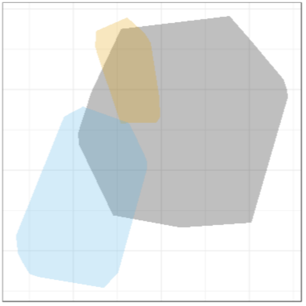
]


.fixed-pos-r[
```{r, echo = FALSE, out.width='425px'}
g <- grViz(
	"
	digraph spatsoc_functions  {
	graph [rankdir=TB, compound=TRUE, fontname = 'Helvetica', bgcolor = '#FAFAFA']
  node [fontname = 'Helvetica'];

	# functions
	spgrp [label = 'spatial grouping', shape = 'rectangle', color='red']
	tgrp [label = 'temporal grouping', shape = 'rectangle']
	rand [label = 'randomizations', shape = 'rectangle']

	# input
	input [label = 'telemetry data', shape = 'diamond']

	# output
	obs [label = 'observed network', shape = 'ellipse']
	rdm [label = 'randomized networks', shape = 'ellipse']


	{rank=same; rdm; obs}

	input -> tgrp -> spgrp -> obs
	spgrp -> rand -> rdm
	}
	")
g
```
]


---

# Spatial grouping 

all three spatial grouping functions internally use the same logic:

1. use GIS operations to build a logical matrix
1. use `igraph` to calculate the connected components

.center[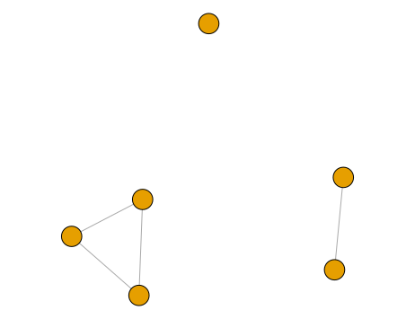]

---

# Flexible thresholds

.pull-left[
spatiotemporal grouping with spatsoc is flexible to different user data:

1. Temporal thresholding can be a value on the scale of minutes, hours or days

2. Spatial threshold can be 0 for simple overlap and intersection or any positive value for buffered overlap

.warn[
Note that this flexibility comes with a requirement  

for system specific knowledge and/or sensitivity analysis.
]

]

.sidebar[
Package checklist:

$\> \checkmark$ novel and interesting method   
$\> \checkmark$ easy to use, flexible   
$\> \Box$ extensive documentation  
$\> \Box$ well tested  
]


???
e.g. this warn is a TODO for us

---

# Social network analysis
```{r, eval = FALSE}
randomizations(DT, type = 'trajectory', ...)
    
get_gbi(DT = DT, group = 'group', id = 'ID')
``` 


.pull-left[
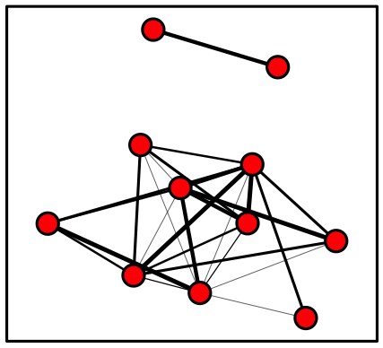


|   |  A|  B|  C|  D|  E|  F|
|:--|--:|--:|--:|--:|--:|--:|
|1  |  1|  1|  1|  0|  1|  1|
|2  |  1|  1|  1|  0|  1|  1|
|3  |  0|  0|  0|  1|  0|  0|
|4  |  0|  0|  0|  1|  0|  0|


]


.fixed-pos-r[
```{r, echo = FALSE, out.width='425px'}
g <- grViz(
	"
	digraph spatsoc_functions  {
	graph [rankdir=TB, compound=TRUE, fontname = 'Helvetica', bgcolor = '#FAFAFA']
  node [fontname = 'Helvetica'];

	# functions
	spgrp [label = 'spatial grouping', shape = 'rectangle']
	tgrp [label = 'temporal grouping', shape = 'rectangle']
	rand [label = 'randomizations', shape = 'rectangle', color='red']

	# input
	input [label = 'telemetry data', shape = 'diamond']

	# output
	obs [label = 'observed network', shape = 'ellipse']
	rdm [label = 'randomized networks', shape = 'ellipse']


	{rank=same; rdm; obs}

	input -> tgrp -> spgrp
	spgrp -> obs [color='red']
	spgrp -> rand
	rand -> rdm	[color='red']
	}
	")
g
```
]


---
background-image: url("images/ropensci.png")
background-position: center
background-size: contain


# rOpenSci software review

<!-- 
* Editors, reviewers
* Standard of rOpenSci: documentation, ease of use
* What did the reviewers comment on/ask for improvement
-->

???
share this: https://github.com/ropensci/onboarding/issues/237
and this: https://ropensci.org/blog/2018/12/04/spatsoc/


---

# rOpenSci software review

.pull-left[
* common goal of improving the package
* emphasize extensive testing, continuous integration and user accessibility
]

.sidebar[
Package checklist:

$\> \checkmark$ original and useful method   
$\> \checkmark$ easy to use, flexible   
$\> \checkmark$ extensive documentation  
$\> \checkmark$ well tested  
]


.fixed-pos-b[[](https://ropensci.org)]


---

# rOpenSci software review

.pull-left[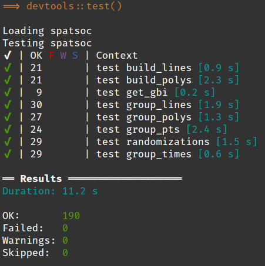]


.sidebar[
Package checklist:

$\> \checkmark$ original and useful method   
$\> \checkmark$ easy to use, flexible   
$\> \checkmark$ extensive documentation  
$\> \checkmark$ well tested  
]

???
expectations
<!--basic testing example-->


```{r, eval = FALSE, echo = FALSE}
library(data.table)
library(mapview)
DT <- fread('../data/FogoCaribou.csv')
utm <- '+proj=utm +zone=21 +ellps=WGS84 +datum=WGS84 +units=m +no_defs '

mapview(DT, xcol = 'X_COORD', ycol = 'Y_COORD')
```
<!-- this example  -->


---
# Next steps: functions

* ### dyadic pairing
* ### spatial point clustering 


.center[[](https://github.com/ropensci/spatsoc/issues)]

---
# Next steps: applications

* #### spatsoc essentially boils down to points in time and space

* #### Can be used to determine encounter rates among predators and prey

* #### Could also be used to determine proximity of individuals to fixed locations

.center[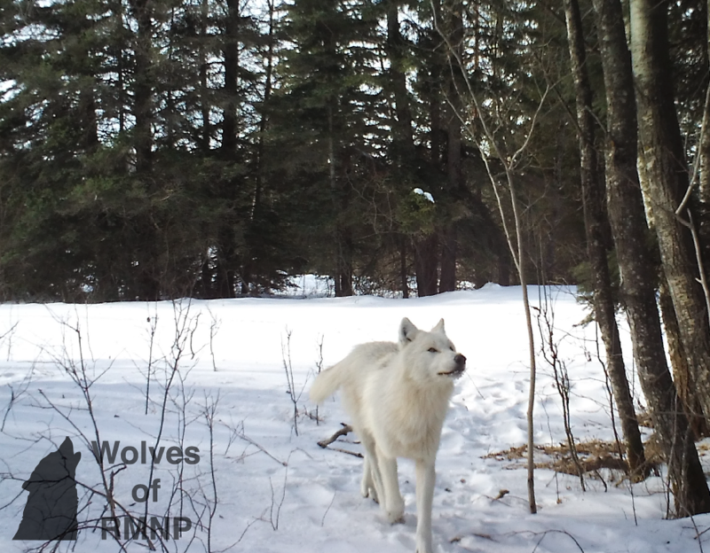]


---
# Conclusion
* ### spatsoc is an R package that groups GPS relocations in time and space

* ### Primary intention was to generate proximity based social networks, but other use-cases available

* ### spatsoc is in revision for publication, but we’re always looking to grow the package and the functions

* ### If you have an idea, let us know or open an issue!


---
# Acknowledgements

.center[

[](weel.gitlab.io)


[](https://ropensci.org)


]

.footnote[
This presentation was built using [Yihui Xie's xaringan package](https://github.com/yihui/xaringan). 
]
