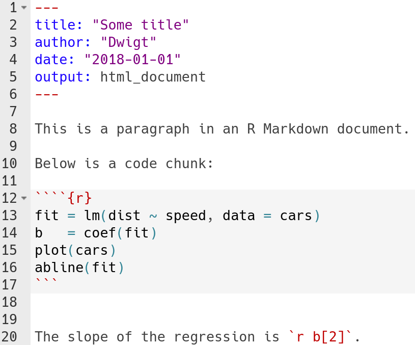
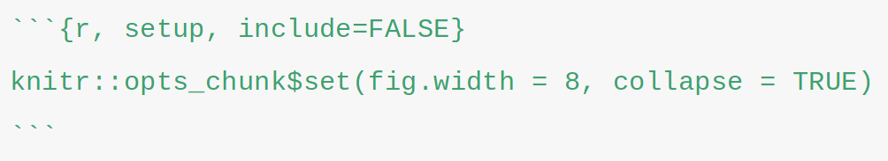

  
```{r setup, include=FALSE}
knitr::opts_chunk$set(echo = TRUE,
                      eval = TRUE)
```

# R Markdown

.pull-left[
[R Markdown: The Definitive Guide](https://bookdown.org/yihui/rmarkdown/) 


[bookdown: Authoring Books and Technical Documents with R Markdown](https://bookdown.org/yihui/bookdown/)


]

.pull-right[

R Markdown combines: 
* [`knitr`](https://github.com/yihui/knitr)  - executes code chunks and converts from Rmd to md
* [Pandoc](https://pandoc.org/) - converts from md to any format (pdf, docx, html, ...)

Helper packages include:
* [`pander`](https://github.com/Rapporter/pander) - converts R objects to markdown
* [`tinytex`](https://github.com/yihui/tinytex) - provides a cross-platform, lightweight LaTeX distribution (for rendering PDFs)
* [`kableExtra`](https://github.com/haozhu233/kableExtra) - styles `knitr` tables
* [`bookdown`](https://github.com/rstudio/bookdown) - extends R Markdown


]

---

# Demo: why use R Markdown?


---


# Markup languages


???
* Presentational: *Word* (not a "language")
* Descriptive: LaTeX
* Lightweight: Markdown

---
# Markdown basics

.pull-left[
```
# Header one   


## Header two   


*Italics*  


**Bold**   


```
]


.pull-right[
# Header one
## Header two

*Italics*

**Bold**


]

.footnote[[Cheatsheet](https://github.com/rstudio/cheatsheets/raw/master/rmarkdown-2.0.pdf)]


???
image local or URL


---
# A minimum working example

`example-basic.Rmd`




???
Three parts of an RMarkdown document:
* YAML
* text
* code chunks and inline code


---
class: example

# Example: minimum working example


1. Open `examples/example-basic.Rmd`

1. Knit the document

1. Check out the results

1. Add Markdown in the text (headers, bold, ...)


---
# YAML frontmatter


* Output format
* Author, title, date
* Document properties: font size, line spacing, bibliography file

```yaml
---
title: "Some title"
author: "Dwigt"
date: "2018-01-01"
output: html_document
---
```

* See `?rmarkdown::pdf_document`, `?rmarkdown::word_document`, ... for details


---
class: example

# Example: YAML frontmatter 

```yaml
---
title: "Some title"
author: "Dwigt"
date: "2018-01-01"
output: html_document
---
```

1. Open `examples/example-basic.Rmd`

1. Switch the output to `word_document` or `pdf_document`

1. Update the title and author fields

1. Add a table of contents ([hint](https://bookdown.org/yihui/rmarkdown/pdf-document.html#table-of-contents-1))

1. Knit the document!

.footnote[
See options relevant to each output type in the [cheatsheet](https://github.com/rstudio/cheatsheets/raw/master/rmarkdown-2.0.pdf) or extended descriptions in the [R Markdown book](https://bookdown.org/yihui/rmarkdown)
]


???
break it with tabs not spaces


---
# Code chunks




* Three back ticks

* Curly braces

* Language name (`r`, `python`, `bash`, [etc](https://bookdown.org/yihui/rmarkdown/language-engines.html))

* Chunk label and options


---
class: example

# Example: code chunks

1. Open `examples/example-basic.Rmd`
1. Remove the base R plot
1. Load `ggplot2`
1. Plot the cars dataset with `qplot()` or `ggplot()` e.g.: `qplot(speed, dist, data = cars)`
1. Knit the document!


class: example

# Example: chunk options

.footnote[
[List of chunk options](https://yihui.name/knitr/options/)
]

1. Open `examples/example-basic.Rmd`
1. Set the figure width and figure height ([hint](https://yihui.name/knitr/options/#plots))
1. Knit the document!


---
# Useful chunk options


**TODO:  Look for good img / table by category/type of option**

* `echo`
* `eval` 
* `fig.width`
* `fig.height`
* `include`
* 

---
class: review

# Review:

**TODO: fix this bg color** 

## YAML
To set:
* document type - PDF, Word, HTML, Markdown
* author, date
* document options - font type and size, 

## Code chunks
To either:
* Run code producing figures, tables, *numbers*
* Show code 


* Chunk options: include code (`echo`), run code (`eval`), set figure options

## Text
All other text surrounding code chunks and inline code. Text references, citations, etc. 


---
# Styling Word documents


```yaml
---
title: "Some title"
author: "Dwigt"
date: "2018-01-01"
output:
  word_document:
*    reference_docx: styles.docx
---
```


1. Set desired styles in the reference docx (`examples/styles.docx`)
1. Add path in YAML
1. Knit the document!


---
# Captions with text references

1. **Switch the output format** to `bookdown::word_document2`
1. Use `(ref:label)` syntax to set the caption's label
1. Pass the label to `fig.cap` chunk option


````markdown
A normal paragraph.

(ref:fig1) A scatterplot of the data `cars` using base R graphics. 

`r ''````{r, fig.cap='(ref:fig1)'}
plot(cars)
```

Another paragraph.

(ref:tab1) A summary table of the data `cars` using base R graphics. 

`r ''````{r, fig.cap='(ref:tab1)'}
knitr::kable(summary(cars))
```
````

???
The syntax for a text reference is (ref:label) text, where label is a unique label throughout the document for text. It must be in a separate paragraph with empty lines above and below it. The paragraph must not be wrapped into multiple lines, and should not end with a white space. 

This only works with `bookdown::word_document2`

---
# Extra: bibliographies

1. create a `references.bib` file
1. add `bibliography: references.bib` to the YAML
1. fill the `references.bib` (manually, using [Mendeley](https://blog.mendeley.com/2011/10/25/howto-use-mendeley-to-create-citations-using-latex-and-bibtex/) or [Zotero](https://github.com/retorquere/zotero-better-bibtex))
1. cite with reference key e.g.: `[@vanderwal2015]` becomes (Vander Wal et al., 2015)

```bib
@article{vanderwal2015,
    author = {Vander Wal, Eric and Gagné-Delorme, Audrey and Festa-Bianchet, Marco and Pelletier, Fanie},
    title = "{Dyadic associations and individual sociality in bighorn ewes}",
    journal = {Behavioral Ecology},
    volume = {27},
    number = {2},
    pages = {560-566},
    year = {2015},
    month = {11},
    issn = {1045-2249},
    doi = {10.1093/beheco/arv193},
    url = {https://doi.org/10.1093/beheco/arv193},
    eprint = {http://oup.prod.sis.lan},
}

```

---
class: important

# Important notes

* R Markdown documents always set the working directory relative to the `.Rmd` file

* YAML does not accept spaces, *only tabs*

* Git diff-able formats: `output: github_document` or `keep_me: true`. For (small) data - use CSVs. 

* Something isn't working? (common example: bullets aren't formatting correctly) - add spaces everywhere. 

* when working with PDF outputs, remember it uses a LaTeX  intermediate, so most solutions for LaTeX will work too. 

.footnote[
shortcuts! `ctrl/cmd + shift + k`
]


---
# Resource

[R Markdown Gallery](https://rmarkdown.rstudio.com/gallery.html)

[R Markdown Cheatsheet](https://github.com/rstudio/cheatsheets/raw/master/rmarkdown-2.0.pdf)

[Yihui Xie's Customizing & Extending R Markdown](https://slides.yihui.name/2017-rstudio-conf-ext-rmd-Yihui-Xie.html#1)

[`knitr`](https://github.com/yihui/knitr) 

[R Markdown: The Definitive Guide](https://bookdown.org/yihui/rmarkdown/) 


 

 


https://rmarkdown.rstudio.com/articles_docx.html


---

# Setup

1. Install packages
  * knitr, tinytex, rmarkdown, bookdown, kableExtra, pander
2. Install tinytex
  * `tinytex::install_tinytex()`

