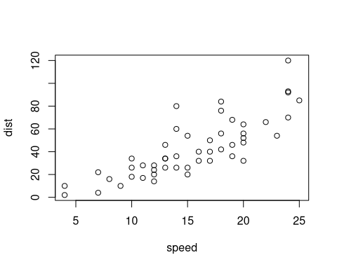

# A normal paragraph.


(ref:foo) Define a text reference **here**. 


\@ref(ref:foo)


(ref:foo)


(ref:bar) A scatterplot of the data `cars` using **base** R graphics. 


```r
plot(cars)  # a scatterplot
```


